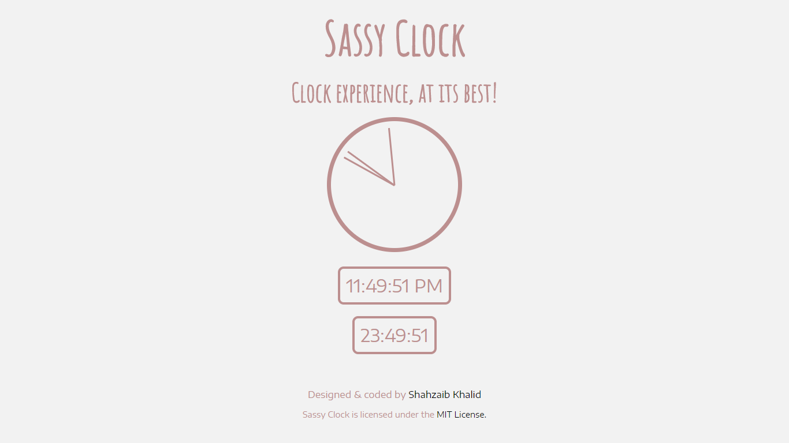
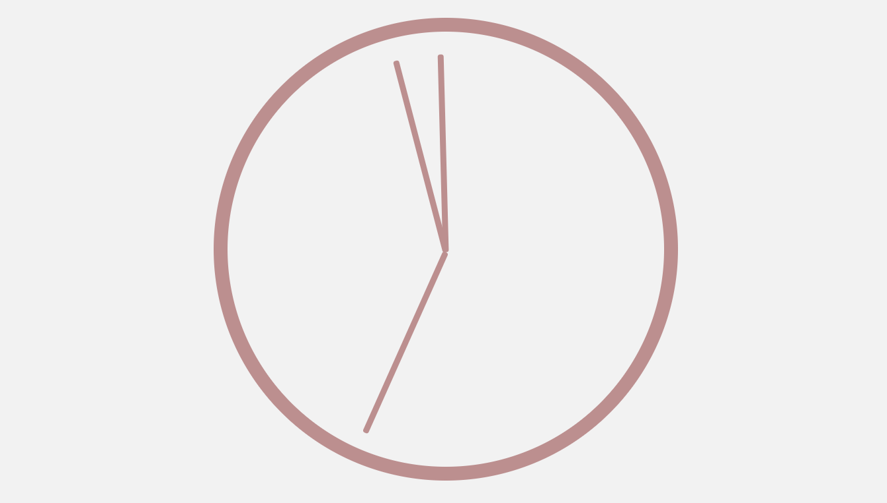
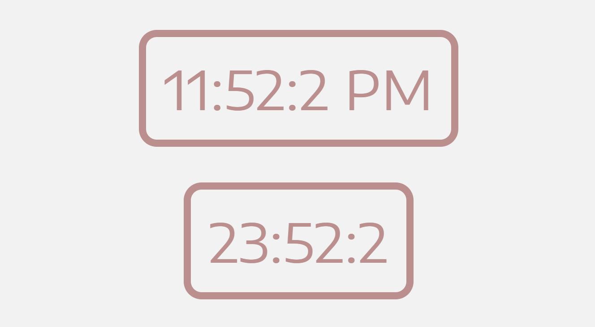

<h1 align="center">Sassy Clock</h1>
<h3 align="center">Clock Experience, at Best</h3>

A minimal yet beautiful, all in one clock experience, built using HTML, CSS &amp; JavaScript.

## Detail
Sassy Clock provides a minimal, beautiful and personal clock experience. It displays time, both in analog and digital formats. Digital format includes both, 24 hours and 12 hours format.

## Design
This is how the design looks like:

## Demo
You can watch a demo by clicking [here](https://shahzaibkhalid.github.io/sassy-clock/)

## License
Sassy Clock is licensed under the [MIT License](https://github.com/shahzaibkhalid/sassy-clock/blob/master/LICENSE.txt).

Copyright (c) 2017 Shahzaib Khalid
